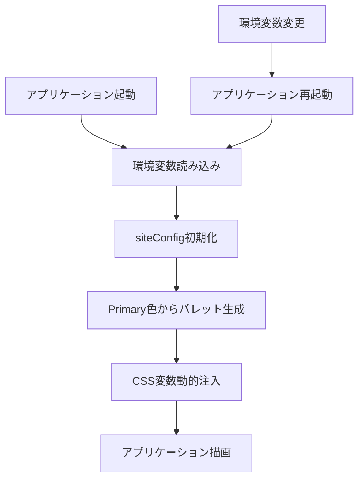

# policy-edit カラーパレット動的生成設計書

## 概要
policy-editアプリケーションのCSS色定義を環境変数で管理可能にし、chroma.jsを使用してカラーパレットを動的生成する仕組みを構築します。docker-compose経由での環境変数設定も含めて設計します。

## 要件
- **Primary色**: 環境変数 `VITE_PRIMARY_COLOR` で設定可能（デフォルト: `#00aaff`）
- **Secondary色**: グレースケール固定
- **Accent色**: 現在の緑系で固定
- **カラーパレット**: 11段階（50, 100, 200, 300, 400, 500, 600, 700, 800, 900, 950）で現在のTailwind CSS v4形式に対応
- **Docker環境**: docker-compose経由で環境変数を設定可能

## 設計詳細

### 1. 依存関係の追加
```bash
cd policy-edit/frontend
npm install chroma-js
npm install --save-dev @types/chroma-js
```

### 2. 型定義の拡張
`policy-edit/frontend/src/types/siteConfig.ts`を拡張し、カラー設定を追加：

```typescript
export interface ColorPalette {
  50: string;   // lightest
  100: string;  // very light
  200: string;  // light
  300: string;  // light medium
  400: string;  // medium light
  500: string;  // base
  600: string;  // medium dark
  700: string;  // dark
  800: string;  // very dark
  900: string;  // darkest
  950: string;  // ultra dark
}

export interface SiteConfig {
  siteName: string;
  logoUrl: string;
  colors: {
    primary: ColorPalette;
    secondary: ColorPalette;
    accent: ColorPalette;
  };
}
```

### 3. カラー生成ユーティリティ
新しいファイル `policy-edit/frontend/src/utils/colorUtils.ts` を作成：

```typescript
import chroma from 'chroma-js';
import type { ColorPalette } from '../types/siteConfig';

export function generatePrimaryPalette(baseColor: string): ColorPalette {
  const base = chroma(baseColor);

  // 基準色（500）から上下に段階的に明度を調整
  return {
    50: base.luminance(0.95).hex(),    // 最も明るい
    100: base.luminance(0.85).hex(),   // とても明るい
    200: base.luminance(0.75).hex(),   // 明るい
    300: base.luminance(0.65).hex(),   // やや明るい
    400: base.luminance(0.55).hex(),   // 少し明るい
    500: base.hex(),                   // 基準色
    600: base.luminance(0.35).hex(),   // 少し暗い
    700: base.luminance(0.25).hex(),   // やや暗い
    800: base.luminance(0.15).hex(),   // 暗い
    900: base.luminance(0.08).hex(),   // とても暗い
    950: base.luminance(0.04).hex(),   // 最も暗い
  };
}

export function getFixedSecondaryPalette(): ColorPalette {
  return {
    50: '#f9fafb',
    100: '#f3f4f6',
    200: '#e5e7eb',
    300: '#d1d5db',
    400: '#9ca3af',
    500: '#6b7280',
    600: '#4b5563',
    700: '#374151',
    800: '#1f2937',
    900: '#111827',
    950: '#030712',
  };
}

export function getFixedAccentPalette(): ColorPalette {
  return {
    50: 'hsl(170 64.3% 83.5%)',   // 最も明るい
    100: 'hsl(170 64.1% 77.1%)',  // とても明るい
    200: 'hsl(170 62.7% 70.6%)',  // 明るい
    300: 'hsl(170 62.8% 64.1%)',  // やや明るい
    400: 'hsl(170 62.2% 57.5%)',  // 少し明るい
    500: 'hsl(170 62.2% 51.2%)',  // 基準色
    600: 'hsl(170 77.1% 44.5%)',  // 少し暗い
    700: 'hsl(170 100.0% 38.2%)', // やや暗い
    800: 'hsl(170 100.0% 31.8%)', // 暗い
    900: 'hsl(170 100.0% 25.5%)', // とても暗い
    950: 'hsl(170 100.0% 19.2%)', // 最も暗い
  };
}
```

### 4. siteConfig の更新
`policy-edit/frontend/src/config/siteConfig.ts`を作成：

```typescript
import type { SiteConfig } from "../types/siteConfig";
import { generatePrimaryPalette, getFixedSecondaryPalette, getFixedAccentPalette } from "../utils/colorUtils";

const DEFAULT_SITE_NAME = "いどばた政策";
const DEFAULT_LOGO_URL = "";
const DEFAULT_PRIMARY_COLOR = "#00aaff";

export const siteConfig: SiteConfig = {
  siteName: import.meta.env.VITE_SITE_NAME || DEFAULT_SITE_NAME,
  logoUrl: import.meta.env.VITE_SITE_LOGO_URL || DEFAULT_LOGO_URL,
  colors: {
    primary: generatePrimaryPalette(import.meta.env.VITE_PRIMARY_COLOR || DEFAULT_PRIMARY_COLOR),
    secondary: getFixedSecondaryPalette(),
    accent: getFixedAccentPalette(),
  },
};
```

### 5. CSS変数の動的生成
新しいファイル `policy-edit/frontend/src/utils/cssVariables.ts` を作成：

```typescript
import { siteConfig } from '../config/siteConfig';

export function generateCSSVariables(): string {
  const { colors } = siteConfig;

  return `
    :root {
      --color-primary-50: ${colors.primary[50]};
      --color-primary-100: ${colors.primary[100]};
      --color-primary-200: ${colors.primary[200]};
      --color-primary-300: ${colors.primary[300]};
      --color-primary-400: ${colors.primary[400]};
      --color-primary-500: ${colors.primary[500]};
      --color-primary-600: ${colors.primary[600]};
      --color-primary-700: ${colors.primary[700]};
      --color-primary-800: ${colors.primary[800]};
      --color-primary-900: ${colors.primary[900]};
      --color-primary-950: ${colors.primary[950]};

      --color-secondary-50: ${colors.secondary[50]};
      --color-secondary-100: ${colors.secondary[100]};
      --color-secondary-200: ${colors.secondary[200]};
      --color-secondary-300: ${colors.secondary[300]};
      --color-secondary-400: ${colors.secondary[400]};
      --color-secondary-500: ${colors.secondary[500]};
      --color-secondary-600: ${colors.secondary[600]};
      --color-secondary-700: ${colors.secondary[700]};
      --color-secondary-800: ${colors.secondary[800]};
      --color-secondary-900: ${colors.secondary[900]};
      --color-secondary-950: ${colors.secondary[950]};

      --color-accent-50: ${colors.accent[50]};
      --color-accent-100: ${colors.accent[100]};
      --color-accent-200: ${colors.accent[200]};
      --color-accent-300: ${colors.accent[300]};
      --color-accent-400: ${colors.accent[400]};
      --color-accent-500: ${colors.accent[500]};
      --color-accent-600: ${colors.accent[600]};
      --color-accent-700: ${colors.accent[700]};
      --color-accent-800: ${colors.accent[800]};
      --color-accent-900: ${colors.accent[900]};
      --color-accent-950: ${colors.accent[950]};
    }
  `;
}

export function injectCSSVariables(): void {
  const styleElement = document.createElement('style');
  styleElement.textContent = generateCSSVariables();
  document.head.appendChild(styleElement);
}
```

### 6. アプリケーション初期化の更新
`policy-edit/frontend/src/main.tsx`でCSS変数を注入：

```typescript
import { injectCSSVariables } from './utils/cssVariables';

// CSS変数を動的に注入
injectCSSVariables();
```

### 7. index.css の更新
`policy-edit/frontend/src/index.css`の`@theme`セクション（15-51行目）の既存のCSS変数定義を削除し、動的に生成されるCSS変数を使用。

削除対象：
```css
@theme {
  --color-primary-50: hsl(212 100.0% 91.2%);
  --color-primary-100: hsl(214 100.0% 86.5%);
  /* ... 全てのprimary, secondary, accent色定義 ... */
  --color-accent-950: hsl(170 100.0% 19.2%);
}
```

### 8. Docker環境設定

#### 8.1 .env.template の更新
プロジェクトルートの `.env.template` にpolicy-edit用の環境変数を追加：

```bash
# Policy Edit Configuration
VITE_PRIMARY_COLOR=#00aaff
VITE_SITE_NAME=いどばた政策
VITE_SITE_LOGO_URL=
```

#### 8.2 docker-compose.yml の更新
policy-editサービス用の設定を追加：

```yaml
services:
  policy-edit:
    build:
      context: ./policy-edit/frontend
      dockerfile: Dockerfile
    ports:
      - "3001:3000"
    environment:
      - VITE_PRIMARY_COLOR=${VITE_PRIMARY_COLOR:-#00aaff}
      - VITE_SITE_NAME=${VITE_SITE_NAME:-いどばた政策}
      - VITE_SITE_LOGO_URL=${VITE_SITE_LOGO_URL:-}
    env_file:
      - .env
    volumes:
      - ./policy-edit/frontend:/app
      - /app/node_modules
    command: npm run dev -- --host 0.0.0.0
```

#### 8.3 Dockerfile の作成
`policy-edit/frontend/Dockerfile` を作成：

```dockerfile
FROM node:18-alpine

WORKDIR /app

COPY package*.json ./
RUN npm ci

COPY . .

EXPOSE 3000

CMD ["npm", "run", "dev", "--", "--host", "0.0.0.0"]
```

#### 8.4 開発用 Dockerfile
`policy-edit/frontend/Dockerfile.dev` を作成：

```dockerfile
FROM node:18-alpine

WORKDIR /app

COPY package*.json ./
RUN npm ci

EXPOSE 3000

CMD ["npm", "run", "dev", "--", "--host", "0.0.0.0"]
```

## 処理フロー図



## 使用例

### ローカル開発
```bash
# 環境変数でPrimary色を設定
cd policy-edit/frontend
VITE_PRIMARY_COLOR="#ff6b35" npm run dev

# デフォルト色（#00aaff）で起動
npm run dev
```

### Docker環境
```bash
# .envファイルを作成
cp .env.template .env

# .envファイルでPrimary色を設定
echo "VITE_PRIMARY_COLOR=#ff6b35" >> .env

# Docker Composeで起動
docker-compose up policy-edit

# 特定の色で起動
VITE_PRIMARY_COLOR="#ff6b35" docker-compose up policy-edit
```

## 実装手順

1. **依存関係の追加**
   - policy-edit/frontendディレクトリでchroma.jsをインストール

2. **型定義の拡張**
   - `policy-edit/frontend/src/types/siteConfig.ts`にColorPalette型を追加

3. **ユーティリティの作成**
   - `policy-edit/frontend/src/utils/colorUtils.ts`でカラー生成関数を作成
   - `policy-edit/frontend/src/utils/cssVariables.ts`でCSS変数生成関数を作成

4. **設定ファイルの作成**
   - `policy-edit/frontend/src/config/siteConfig.ts`を作成

5. **アプリケーション初期化の更新**
   - `policy-edit/frontend/src/main.tsx`でCSS変数注入を追加

6. **スタイルの更新**
   - `policy-edit/frontend/src/index.css`の既存CSS変数定義を削除

7. **Docker環境の設定**
   - `.env.template`にpolicy-edit用環境変数を追加
   - `docker-compose.yml`にpolicy-editサービスを追加
   - `policy-edit/frontend/Dockerfile`と`Dockerfile.dev`を作成

8. **テスト**
   - ローカル環境とDocker環境での動作確認

## 期待される効果

この設計により、以下が実現されます：

- **環境変数による色設定**: `.env`ファイルまたは環境変数でPrimary色を変更可能
- **Docker対応**: docker-compose経由での環境変数設定
- **動的カラーパレット**: chroma.jsによる自動的な色階調生成
- **開発効率向上**: 色変更のためのCSS編集が不要
- **デプロイメント柔軟性**: 環境ごとに異なる色設定が可能

policy-editアプリケーション全体のカラーテーマが環境変数一つで動的に変更され、Docker環境でも簡単に管理できるようになります。
