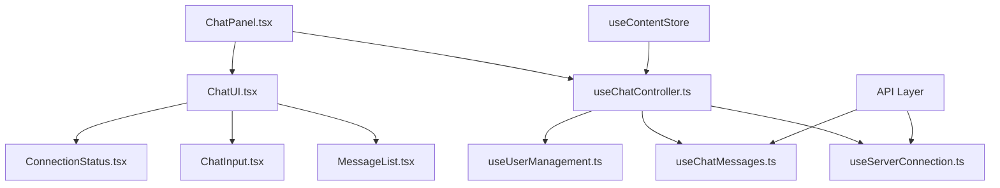

# ChatPanel改善設計書

## 作成日時
2025年5月31日 18:38

## 概要
ChatPanel.tsxのロジックとUIが混在している問題を解決し、複数ルートでの使用に対応した保守性の高い設計に改善する。

## 現状分析

### 問題点
1. **単一責任原則の違反**: 500行を超える巨大コンポーネント
2. **複数の責任を持つ**: サーバー接続、メッセージ管理、UI制御、エラーハンドリング
3. **テスタビリティの問題**: ロジックとUIが密結合
4. **複数ルートでの状態管理**: 各ルートで異なる動作パターンが必要

### 使用状況
- **Layout.tsx**: 全ルートで常時表示
- **動作パターン**:
  - MDファイル表示時: チャット機能有効
  - ディレクトリ表示時: チャット機能無効
  - 404ページ時: チャット機能無効

### 状態依存の動作
```typescript
// 現在の状態判定ロジック
const isMdFileActive = useMemo(() => {
  return contentType === "file" && currentPath.endsWith(".md");
}, [contentType, currentPath]);
```

## 改善設計

### アーキテクチャ概要



### 1. カスタムフック層の設計

#### `hooks/useServerConnection.ts`
**責任**: サーバー接続状態の管理
```typescript
interface UseServerConnectionReturn {
  isConnected: boolean;
  isLoading: boolean;
  error: string | null;
  connect: () => Promise<void>;
  checkStatus: () => Promise<boolean>;
}
```

**主要機能**:
- 初期接続試行
- 手動接続処理
- 接続状態監視
- エラーハンドリング

#### `hooks/useChatMessages.ts`
**責任**: チャットメッセージの送受信管理
```typescript
interface UseChatMessagesReturn {
  sendMessage: (message: string) => Promise<void>;
  isLoading: boolean;
  error: string | null;
}
```

**主要機能**:
- メッセージ送信処理
- API通信
- 履歴管理
- コンテキスト準備（ファイルコンテンツ、branchId）

#### `hooks/useUserManagement.ts`
**責任**: ユーザー情報管理
```typescript
interface UseUserManagementReturn {
  userName: string | null;
  setUserName: (name: string) => void;
  promptForName: () => Promise<string>;
}
```

**主要機能**:
- ユーザー名の取得・設定
- localStorage操作
- 名前入力プロンプト

#### `hooks/useChatController.ts`
**責任**: チャット機能全体の制御
```typescript
interface UseChatControllerReturn {
  // 状態
  isChatEnabled: boolean;
  currentThread: ChatThread | null;
  messages: Message[];

  // サーバー接続
  connection: UseServerConnectionReturn;

  // メッセージ管理
  messageHandler: UseChatMessagesReturn;

  // ユーザー管理
  userManager: UseUserManagementReturn;

  // UI制御
  inputValue: string;
  setInputValue: (value: string) => void;
  handleSendMessage: () => Promise<void>;
  handleKeyDown: (event: React.KeyboardEvent) => void;
}
```

### 2. UIコンポーネント層の設計

#### `components/chat/ChatUI.tsx`
**責任**: チャットUIの全体レイアウト
```typescript
interface ChatUIProps {
  controller: UseChatControllerReturn;
}
```

#### `components/chat/MessageList.tsx`
**責任**: メッセージ一覧の表示
```typescript
interface MessageListProps {
  messages: Message[];
  isLoading: boolean;
  isChatEnabled: boolean;
  currentPath: string;
}
```

**主要機能**:
- メッセージ一覧表示
- 自動スクロール
- 状態別メッセージ表示

#### `components/chat/ChatInput.tsx`
**責任**: メッセージ入力UI
```typescript
interface ChatInputProps {
  value: string;
  onChange: (value: string) => void;
  onSend: () => void;
  onKeyDown: (event: React.KeyboardEvent) => void;
  disabled: boolean;
  placeholder: string;
}
```

#### `components/chat/ConnectionStatus.tsx`
**責任**: 接続状態の表示と制御
```typescript
interface ConnectionStatusProps {
  isConnected: boolean;
  isLoading: boolean;
  onConnect: () => void;
}
```

### 3. 型定義とユーティリティ

#### `types/chat.ts`
```typescript
export interface OpenAIMessage {
  role: "user" | "assistant" | "system" | "function";
  content: string | null;
  name?: string;
  function_call?: {
    name: string;
    arguments: string;
  };
}

export interface ChatMessage {
  id: number;
  text: string;
  sender: "user" | "bot";
}

export interface ChatThread {
  messages: ChatMessage[];
  branchId: string | null;
  nextMessageId: number;
}
```

#### `utils/chatUtils.ts`
```typescript
export const getFormattedFileName = (path: string): string => {
  if (!path) return "";
  const fileName = path.split("/").pop() || "";
  return fileName.endsWith(".md") ? fileName.slice(0, -3) : fileName;
};

export const prepareChatHistory = (messages: ChatMessage[]): OpenAIMessage[] => {
  return messages.map(msg => ({
    role: msg.sender === "user" ? "user" : "assistant",
    content: msg.text,
  }));
};
```

## 実装手順

### Phase 1: カスタムフック抽出（優先度：高）

1. **useServerConnection.ts**の実装
   - 接続管理ロジックの抽出
   - エラーハンドリングの統一

2. **useUserManagement.ts**の実装
   - ユーザー名管理の分離
   - localStorage操作の抽象化

3. **useChatMessages.ts**の実装
   - メッセージ送信ロジックの抽出
   - API通信の抽象化

4. **useChatController.ts**の実装
   - 各フックの統合
   - UI制御ロジックの集約

### Phase 2: UIコンポーネント分割（優先度：中）

1. **MessageList.tsx**の実装
   - メッセージ表示ロジックの分離
   - スクロール管理の独立化

2. **ChatInput.tsx**の実装
   - 入力制御の分離
   - キーボードイベント処理

3. **ConnectionStatus.tsx**の実装
   - 接続状態表示の分離

4. **ChatUI.tsx**の実装
   - レイアウト制御の統合

### Phase 3: メインコンポーネント簡素化（優先度：中）

1. **ChatPanel.tsx**のリファクタリング
   - カスタムフックの組み合わせのみ
   - UIコンポーネントの配置

### Phase 4: 型定義とユーティリティ整理（優先度：低）

1. **types/chat.ts**の作成
2. **utils/chatUtils.ts**の作成

## 複数ルート対応の考慮事項

### 状態管理の一貫性
- `useContentStore`の状態変化に対する適切な反応
- ルート変更時のチャット状態の保持

### パフォーマンス最適化
- 不要な再レンダリングの防止
- メモ化の適切な使用

### エラーハンドリング
- ルート固有のエラー状態管理
- グローバルエラーとローカルエラーの分離

## 期待される効果

### 保守性向上
- 各機能が独立してテスト・修正可能
- 責任の明確化による影響範囲の限定

### 可読性向上
- 各ファイルが100行以下に
- 機能別の明確な分離

### 再利用性向上
- フックやコンポーネントの他での利用が可能
- 機能の組み合わせによる柔軟な拡張

### テスタビリティ向上
- 各機能のユニットテストが容易
- モックの作成が簡単

### 複数ルート対応
- 各ルートでの一貫した動作
- 状態管理の統一

## リスク評価

### 実装リスク
- **低**: 既存機能の分割のため、新機能追加なし
- **対策**: 段階的な実装とテスト

### 互換性リスク
- **低**: 外部インターフェースは変更なし
- **対策**: 既存のpropsとAPIの維持

### パフォーマンスリスク
- **低**: むしろ最適化により改善予想
- **対策**: 適切なメモ化の実装

## 成功指標

1. **コード品質**
   - 各ファイルが100行以下
   - 循環的複雑度の改善

2. **テストカバレッジ**
   - 各フックのユニットテスト実装
   - 80%以上のカバレッジ達成

3. **保守性**
   - 新機能追加時の影響範囲の限定
   - バグ修正時間の短縮

4. **パフォーマンス**
   - 不要な再レンダリングの削減
   - 初期表示時間の維持
