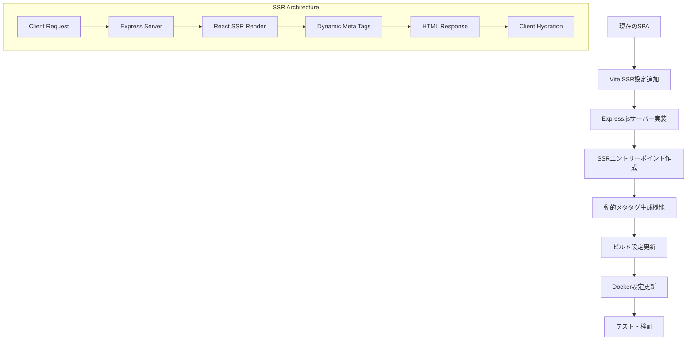

# フロントエンドSSR化手順書

## 概要

現在のReact + ViteのSPAアプリケーションを、動的なOGPメタタグ生成が可能なSSRアプリケーションに変更する手順書です。

## 現状分析

### 現在の構成
- **フレームワーク**: React 19 + Vite
- **ルーティング**: React Router DOM v7
- **スタイリング**: TailwindCSS v4 + shadcn/ui
- **メタタグ管理**: @dr.pogodin/react-helmet
- **状態管理**: Zustand

### 問題点
- SPAのため、Slackなどでのリンク共有時に動的なOGPメタタグが表示されない
- 検索エンジンでの適切なインデックスができない
- 初回表示時のメタタグが環境変数から動的に生成されない

## SSR化戦略

### 採用アプローチ
1. **Vite SSR機能の活用**: ViteのビルトインSSR機能を使用
2. **Express.jsサーバーの追加**: SSRレンダリング用のNode.jsサーバー
3. **動的メタタグ生成**: パスベースでのタイトル・OGP生成
4. **段階的移行**: 既存コードへの影響を最小限に抑制

### アーキテクチャ図



## 実装手順

### 1. 依存関係の追加

#### 新規パッケージのインストール

```bash
cd frontend
npm install express compression serve-static
npm install -D @types/express @types/compression
```

#### package.json の更新

```json
{
  "scripts": {
    "dev": "vite",
    "dev:ssr": "npm run build:server && node dist/server.js",
    "build": "npm run build:client && npm run build:server",
    "build:client": "vite build --outDir dist/client",
    "build:server": "vite build --ssr src/entry-server.tsx --outDir dist/server",
    "start": "node dist/server/entry-server.js",
    "preview": "npm run build && npm run start"
  }
}
```

### 2. プロジェクト構造の変更

```
frontend/
├── src/
│   ├── entry-client.tsx    # クライアントサイドエントリー（新規）
│   ├── entry-server.tsx    # サーバーサイドエントリー（新規）
│   ├── server.ts          # Express SSRサーバー（新規）
│   ├── utils/
│   │   └── metaGenerator.ts # 動的メタタグ生成（新規）
│   ├── App.tsx            # 既存（一部修正）
│   ├── main.tsx           # 既存（クライアント専用に変更）
│   └── （その他既存ファイル）
├── vite.config.ts         # SSR設定追加
└── package.json           # 更新済み
```

### 3. 新規ファイルの作成

#### 3.1 entry-client.tsx

```typescript
import { StrictMode } from "react";
import { hydrateRoot } from "react-dom/client";
import App from "./App";
import "./index.css";
import { injectCSSVariables } from "./utils/cssVariables";

// CSS変数を動的に注入
injectCSSVariables();

const rootElement = document.getElementById("root");

if (!rootElement) {
  throw new Error("Failed to find the root element");
}

hydrateRoot(
  rootElement,
  <StrictMode>
    <App />
  </StrictMode>
);
```

#### 3.2 entry-server.tsx

```typescript
import { renderToString } from "react-dom/server";
import { StaticRouter } from "react-router-dom/server";
import App from "./App";
import { generatePageMeta } from "./utils/metaGenerator";
import { siteConfig } from "./config/siteConfig";

export function render(url: string) {
  // パスからメタタグ情報を生成
  const meta = generatePageMeta(url, siteConfig);

  // React アプリケーションをSSRでレンダリング
  const html = renderToString(
    <StaticRouter location={url}>
      <App />
    </StaticRouter>
  );

  return { html, meta };
}
```

#### 3.3 server.ts

```typescript
import express from "express";
import compression from "compression";
import { createServer as createViteServer } from "vite";
import path from "path";
import fs from "fs";

const isProduction = process.env.NODE_ENV === "production";
const port = process.env.PORT || 3000;

async function createServer() {
  const app = express();

  // gzip圧縮を有効化
  app.use(compression());

  let vite: any;

  if (!isProduction) {
    // 開発環境: Vite dev server
    vite = await createViteServer({
      server: { middlewareMode: true },
      appType: "custom"
    });
    app.use(vite.ssrLoadModule);
  } else {
    // 本番環境: 静的ファイル配信
    app.use(express.static(path.resolve("dist/client")));
  }

  // SSRルート
  app.use("*", async (req, res) => {
    try {
      const url = req.originalUrl;

      let template: string;
      let render: any;

      if (!isProduction) {
        // 開発環境
        template = fs.readFileSync(
          path.resolve("index.html"),
          "utf-8"
        );
        template = await vite.transformIndexHtml(url, template);
        render = (await vite.ssrLoadModule("/src/entry-server.tsx")).render;
      } else {
        // 本番環境
        template = fs.readFileSync(
          path.resolve("dist/client/index.html"),
          "utf-8"
        );
        render = (await import("./dist/server/entry-server.js")).render;
      }

      const { html, meta } = render(url);

      // HTMLテンプレートにSSRコンテンツとメタタグを注入
      const finalHtml = template
        .replace(`<!--ssr-outlet-->`, html)
        .replace(`<title>いどばた政策</title>`, `<title>${meta.title}</title>`)
        .replace(
          `<meta property="og:title" content="いどばた政策" />`,
          `<meta property="og:title" content="${meta.title}" />`
        )
        .replace(
          `<meta name="twitter:title" content="いどばた政策" />`,
          `<meta name="twitter:title" content="${meta.title}" />`
        )
        .replace(
          `<meta name="description" content="市民が集まって対話し、政策を生み出すプラットフォーム「いどばた政策」" />`,
          `<meta name="description" content="${meta.description}" />`
        )
        .replace(
          `<meta property="og:description" content="市民が集まって対話し、政策を生み出すプラットフォーム" />`,
          `<meta property="og:description" content="${meta.description}" />`
        )
        .replace(
          `<meta name="twitter:description" content="市民が集まって対話し、政策を生み出すプラットフォーム" />`,
          `<meta name="twitter:description" content="${meta.description}" />`
        );

      res.status(200).set({ "Content-Type": "text/html" }).end(finalHtml);
    } catch (e: any) {
      if (!isProduction) {
        vite.ssrFixStacktrace(e);
      }
      console.error(e.stack);
      res.status(500).end(e.stack);
    }
  });

  return { app, vite };
}

createServer().then(({ app }) =>
  app.listen(port, () => {
    console.log(`Server started at http://localhost:${port}`);
  })
);
```

#### 3.4 utils/metaGenerator.ts

```typescript
import type { SiteConfig } from "../types/siteConfig";

export interface PageMeta {
  title: string;
  description: string;
  ogImage?: string;
}

export function generatePageMeta(path: string, siteConfig: SiteConfig): PageMeta {
  // ルートパスの場合
  if (path === '' || path === '/' || path === '/view') {
    return {
      title: siteConfig.siteName,
      description: '市民が集まって対話し、政策を生み出すプラットフォーム'
    };
  }

  // /view/ で始まるパスを処理
  const cleanPath = path.replace(/^\/view\//, '').replace(/\/$/, '');

  if (!cleanPath) {
    return {
      title: siteConfig.siteName,
      description: '市民が集まって対話し、政策を生み出すプラットフォーム'
    };
  }

  const pathSegments = cleanPath.split('/').filter(Boolean);
  const lastSegment = pathSegments[pathSegments.length - 1];

  // ファイル拡張子をチェック
  const isFile = lastSegment.includes('.');

  if (isFile) {
    // ファイルの場合
    const fileName = lastSegment;
    return {
      title: `${fileName} - ${siteConfig.siteName}`,
      description: `${fileName}の内容を表示しています`
    };
  } else {
    // ディレクトリの場合
    const dirName = lastSegment;
    return {
      title: `${dirName} - ${siteConfig.siteName}`,
      description: `${dirName}ディレクトリの内容を表示しています`
    };
  }
}
```

### 4. 既存ファイルの修正

#### 4.1 vite.config.ts の更新

```typescript
import path from "node:path";
import tailwindcss from "@tailwindcss/vite";
import react from "@vitejs/plugin-react";
import { defineConfig } from "vite";

export default defineConfig({
  plugins: [react(), tailwindcss()],
  resolve: {
    alias: {
      "@": path.resolve(__dirname, "./src"),
    },
  },
  server: {
    allowedHosts:
      process.env.VITE_POLICY_FRONTEND_ALLOWED_HOSTS?.split(",") || [],
  },
  build: {
    rollupOptions: {
      input: {
        main: path.resolve(__dirname, "index.html"),
      },
    },
  },
  ssr: {
    noExternal: ["react-router-dom"],
  },
});
```

#### 4.2 index.html の更新

```html
<!doctype html>
<html lang="ja">

<head>
  <meta charset="UTF-8" />
  <meta name="viewport" content="width=device-width, initial-scale=1.0" />
  <title>いどばた政策</title>
  <meta name="description" content="市民が集まって対話し、政策を生み出すプラットフォーム「いどばた政策」" />

  <!-- ——— Open Graph ——— -->
  <meta property="og:type" content="website" />
  <meta property="og:locale" content="ja_JP" />
  <meta property="og:title" content="いどばた政策" />
  <meta property="og:description" content="市民が集まって対話し、政策を生み出すプラットフォーム" />
  <meta property="og:url" content="https://delib.takahiroanno.com/" />
  <meta property="og:image" content="https://delib.takahiroanno.com/idobata.png" />
  <meta property="og:image:width" content="1200" />
  <meta property="og:image:height" content="630" />
  <meta property="og:image:alt" content="いどばた政策" />

  <!-- ——— X (Twitter) Card ——— -->
  <meta name="twitter:card" content="summary_large_image" />
  <meta name="twitter:title" content="いどばた政策" />
  <meta name="twitter:description" content="市民が集まって対話し、政策を生み出すプラットフォーム" />
  <meta name="twitter:image" content="https://delib.takahiroanno.com/idobata.png" />
  <meta name="twitter:image:alt" content="いどばた政策" />

</head>

<body>
  <div id="root"><!--ssr-outlet--></div>
  <script type="module" src="/src/entry-client.tsx"></script>
</body>

</html>
```

#### 4.3 App.tsx の修正

```typescript
import { Helmet, HelmetProvider } from "@dr.pogodin/react-helmet";
import { BrowserRouter, Route, Routes, useParams } from "react-router-dom";
import Layout from "./components/layout/Layout";
import ContentExplorer from "./components/page-specific/ContentExplorer";
import NotFound from "./components/page-specific/NotFound";
import { siteConfig } from "./config/siteConfig";

// Wrapper component to extract path from URL splat and pass it to ContentExplorer
function ContentExplorerWrapper() {
  const params = useParams();
  // Get the path after /view/. If no path, default to empty string (root)
  const path = params["*"] || "";
  // Use key={path} to force re-render/remount of ContentExplorer when the path changes
  return <ContentExplorer key={path} initialPath={path} />;
}

function App() {
  // SSRの場合はStaticRouterが使用されるため、条件分岐は不要
  // BrowserRouterはクライアントサイドでのみ使用される
  const RouterComponent = typeof window !== 'undefined' ? BrowserRouter : 'div';

  return (
    <HelmetProvider>
      <Helmet>
        <title>{siteConfig.siteName}</title>
        <link rel="icon" type="image/svg+xml" href={siteConfig.faviconUrl} />
        <meta property="og:title" content={siteConfig.siteName} />
        <meta name="twitter:title" content={siteConfig.siteName} />
      </Helmet>
      <RouterComponent>
        <Routes>
          <Route path="/" element={<Layout />}>
            {/* Route for the repository root */}
            <Route index element={<ContentExplorer initialPath="" />} />
            {/* Route for paths within the repository */}
            <Route path="view/*" element={<ContentExplorerWrapper />} />
            {/* Catch-all route for any other paths (404) */}
            <Route path="*" element={<NotFound />} />
          </Route>
        </Routes>
      </RouterComponent>
    </HelmetProvider>
  );
}

export default App;
```

### 5. Docker設定の更新

#### 5.1 Dockerfile の更新

```dockerfile
FROM node:18-alpine AS builder

WORKDIR /app

# パッケージファイルをコピー
COPY package*.json ./
RUN npm ci

# ソースコードをコピー
COPY . .

# ビルド実行
RUN npm run build

# 本番用イメージ
FROM node:18-alpine AS runner

WORKDIR /app

# 必要なファイルのみコピー
COPY --from=builder /app/dist ./dist
COPY --from=builder /app/package*.json ./
COPY --from=builder /app/node_modules ./node_modules

# 環境変数
ENV NODE_ENV=production
ENV PORT=3000

EXPOSE 3000

# サーバー起動
CMD ["npm", "start"]
```

### 6. 開発・テスト手順

#### 6.1 開発環境での動作確認

```bash
# 開発サーバー起動（SSR）
npm run dev:ssr

# ブラウザで http://localhost:3000 にアクセス
# ページソースを表示して動的メタタグが生成されていることを確認
```

#### 6.2 本番ビルドのテスト

```bash
# 本番ビルド
npm run build

# 本番サーバー起動
npm run start

# 各種パスでのメタタグ生成を確認
# - / (ルート)
# - /view/README.md (ファイル)
# - /view/src (ディレクトリ)
```

#### 6.3 OGP確認方法

1. **Facebook Sharing Debugger**: https://developers.facebook.com/tools/debug/
2. **Twitter Card Validator**: https://cards-dev.twitter.com/validator
3. **Slack**: 実際にリンクを投稿して確認

### 7. 移行時の注意点

#### 7.1 既存コードへの影響
- 現在のコンポーネント構造は維持
- React Helmetは継続使用（SSR対応済み）
- ルーティング構造は変更なし

#### 7.2 環境変数の取り扱い
- **クライアントサイド**: `import.meta.env.VITE_*`
- **サーバーサイド**: `process.env.*`
- 両方で使用する環境変数は適切に設定

#### 7.3 開発体験の維持
- 開発時はVite dev serverを継続使用可能
- HMR（Hot Module Replacement）の維持
- TypeScriptサポートの継続

### 8. 期待される効果

#### 8.1 OGP対応の実現
- Slackなどでのリンク共有時に適切なメタタグ表示
- パスに応じた動的なタイトル・説明文生成
- 環境変数から設定されたサイト情報の反映

#### 8.2 SEO向上
- 検索エンジンでの適切なインデックス
- ページごとの適切なメタ情報
- 初回表示速度の向上

#### 8.3 ユーザー体験の向上
- サーバーサイドでの事前レンダリング
- 初回ペイントの高速化
- ソーシャルメディアでの適切な表示

## トラブルシューティング

### よくある問題と解決方法

1. **Hydration Mismatch**
   - サーバーとクライアントでのレンダリング結果が異なる場合
   - 解決: 条件分岐ロジックの見直し、useEffect の適切な使用

2. **環境変数が読み込まれない**
   - SSR時に環境変数が undefined になる場合
   - 解決: サーバーサイドでの環境変数設定確認

3. **静的ファイルが読み込まれない**
   - CSS や画像ファイルが表示されない場合
   - 解決: Express の静的ファイル配信設定確認

## まとめ

この手順書に従って実装することで、現在のSPAアプリケーションを動的なOGPメタタグ生成が可能なSSRアプリケーションに変更できます。既存のコード構造を最大限維持しながら、必要な機能を追加する設計となっています。
